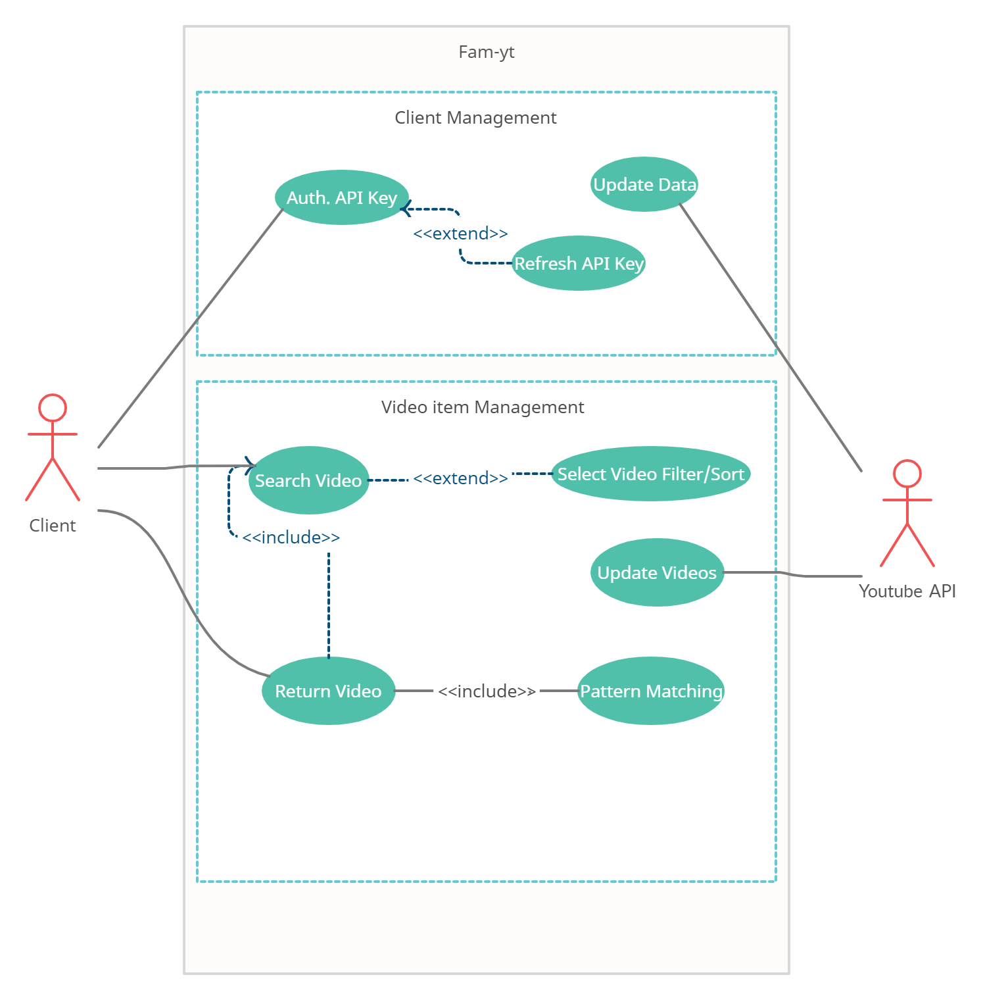

# Fampay Assignment

API to fetch the latest videos sorted in reverse chronological order of their publishing date-time from YouTube for a given tag/search query in a paginated response. This app is written in the Django framework. 


**Use Case Diagram (UML)**


First, we need to clone this Git repository. Run the command below in whichever directory you wish this project to be. 
```sh
$ git clone https://github.com/rajpratyush/FamPay-Assignment.git
```
To install the requirements for this project, navigate to Fampay directory. Running the command below will do so. Make sure you have pip installed on the system you are running this app on.  
```sh
$ pip install -r requirements.txt
```
Before you begin running your app, you should add your YouTube API Key in Fampay/Fampay/settings.py 
```sh
DEVELOPER_KEY = ""
```
Now we navigate back to our base directory and let's run the server and test this app. 
```sh
$ cd Fampay
$ python manage.py runserver
```
Redirect to any of the following URLs to check the data being uploaded in table format. 
```sh
localhost:8000
http://127.0.0.1:8000/
```
**Remarks:**

<ol>
<li> Every 10 seconds, the page is refreshed. </li>

<li> To allow for videos, that are not present in the database, this app when updates every 10 seconds, also updates the publishedAfter argument of the search.list function to a random number. </li>

<li> utils.py contains the utility functions that are used in views.py to make the code more readable and understandable.</li>
<li> Reconfigurable parameters have been added in the setup.py file. These parameters can be changed to see the changes reflected.</li>
</ol>


**References**

- YouTube data v3 API: [https://developers.google.com/youtube/v3/getting-started](https://developers.google.com/youtube/v3/getting-started)

- Search API reference: [https://developers.google.com/youtube/v3/docs/search/list](https://developers.google.com/youtube/v3/docs/search/list)
    - To fetch the latest videos you need to specify these: type=video, order=date, publishedAfter=<SOME_DATE_TIME>
    - Without publishedAfter, it will give you cached results which will be too old

